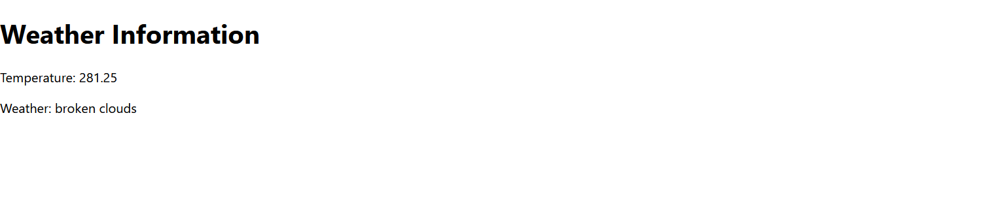

# Weather App

## Overview

This ReactJS application fetches weather information using the OpenWeatherMap API and displays it in a user-friendly interface.

## Screenshots


## Features

- **Dynamic Content**: Use state and hooks for dynamic content changes.
- **Responsive Design**: Ensure the app looks good on different screen sizes.
- **API Integration**: Utilize the OpenWeatherMap API for weather data.

## To Run


   ```bash
   git clone https://github.com/afrotastique/101406358_comp3123_labtest2.git

